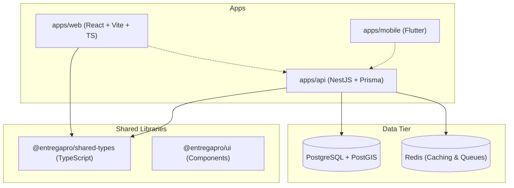

# EntregaPRO: Enterprise Delivery & Fleet Management System

EntregaPRO is a premium, production-grade logistics, dispatch, and delivery tracking monorepo. It couples a robust backend, a comprehensive administration/dispatcher web console, and a companion driver-focused mobile application.

---

## 🏗️ System Architecture

The project is structured as a **pnpm Monorepo** ensuring clean separation of concerns, high reusability, and rapid type-safe development:

*   **`apps/web`**: Web Dashboard built using **React 19**, **Vite**, **TypeScript**, **Tailwind CSS**, and **Zustand**.
*   **`apps/api`**: RESTful API and WebSocket Gateway built on **NestJS**, utilizing **Prisma ORM** for PostgreSQL.
*   **`apps/mobile`**: Native companion application for drivers built in **Flutter (Dart)**.
*   **`packages/shared-types`**: Single source of truth for TypeScript models, DTOs, and RBAC permission sets shared between web and API.
*   **`packages/ui`**: Component library containing reusable UI primitives.

---

## 🌟 Core System Features

### 1. Real-Time Dispatch Board (`dnd-kit`)
*   **Interactive Drag-and-Drop**: Dispatchers can drag pending orders into active driver queues, immediately updating schedules and routes.
*   **Capacity Planning**: Real-time checking of driver vehicle load capacities before allowing dispatches.
*   **Dynamic Sequencing**: Re-order stops and instantly recalculate delivery paths.

### 2. Live Tracking & Geofencing (`Leaflet` + `PostGIS`)
*   **Zone Management**: Drawing custom polyline Delivery Zones directly onto the dashboard map. Spatial coordinates are saved inside PostgreSQL as spatial geometries using PostGIS.
*   **Route Calculation**: Automatically plots the most efficient OSRM routing profiles for multi-stop delivery routes.
*   **Driver Telemetry**: Live updating of driver coordinates with status indicators (On-Route, Delayed, Idle).

### 3. Proof of Delivery (POD System)
*   **Photo Verification**: Supports camera snapshot capture at the point of delivery to record package state.
*   **Digital Signature Canvas**: An HTML5 Canvas/Native Flutter signature pad that allows receivers to sign directly on-screen.
*   **PDF Generation**: Instantly seals photos, coordinates, and signatures into a secure, downloadable proof-of-delivery document.

### 4. Granular RBAC (Role-Based Access Control)
*   **Dynamic Permissions**: Explicit permission gates mapped to staff users (e.g. `fleet:dispatch`, `manifest:write`, `users:manage`, `audit:full`).
*   **Multi-Role Dashboard Filtering**:
    *   **SUPER_ADMIN / ADMIN**: Full overview of fleet logs, financial records, configurations, and user management.
    *   **DISPATCHER**: Focused on the active dispatch map, driver queues, live routes, and order updates.
    *   **ACCOUNTANT**: Specialized billing, invoices, Excel file importing, and payroll reporting.
    *   **DRIVER**: Ultra-focused list of allocated delivery steps, maps, navigation, and proof-of-delivery forms.

### 5. Fleet Fuel & Maintenance Log
*   **Odometer Tracking**: Logs vehicle distance and automatically flags due maintenance dates or inspections.
*   **Fuel Economy Logs**: Full tracking of fuel refuels, costs, active consumption ratios, and driver efficiency metrics.

### 6. Bulk Billing & Loading Verification
*   **Spreadsheet Parsing**: Import bulk client orders and shipping manifests using highly customizable Excel import engines.
*   **Loading Checklists**: Verification steps for warehouse staff to scan packages, making sure items are loaded into matching delivery vehicles before departure.

---

## 🛠️ Complete Technology Stack

### Backend (`apps/api`)
*   **NestJS Framework**: Highly modular controller-service architecture.
*   **Prisma ORM**: Modern database modeling, type-safe queries, and transactional seeds.
*   **BullMQ**: High-performance, Redis-backed job queues for handling background report exports, notification dispatches, and geofencing evaluations.
*   **Socket.IO**: Real-time push communication for live telemetry and dispatcher alert systems.
*   **Helmet & Argon2**: Secure HTTP headers and state-of-the-art cryptographic password hashing.

### Web Console (`apps/web`)
*   **React 19 & Vite**: Ultra-fast hot-reloading bundler and render tree.
*   **Zustand**: Lightweight, high-performance global client state management.
*   **React Leaflet**: Leaflet integration for handling maps, custom vectors, and marker clusters.
*   **Recharts**: Modern SVG graphs for visualizing analytics (fuel costs, driver performance, and delivery timings).
*   **Sonner**: Premium UI toaster notification library.

### Mobile App (`apps/mobile`)
*   **Flutter & Dart**: Highly performant, compiled native mobile views.
*   **Camera Integration**: Quick photo capture for package delivery proof.
*   **Offline Support**: Local cache persistence for operations in zero-connectivity areas.

---

## Web-to-Backend Mapping (May 28, 2026)

### Auth & Session
*   `POST /auth/login` -> `apps/web/src/pages/Login.tsx`
*   `POST /auth/refresh`, `POST /auth/logout` -> token lifecycle
*   `POST /auth/change-password` -> `ChangePasswordModal` (implemented)

### User & Profile
*   `GET /users`, `POST /users`, `PATCH /users/:id`, `DELETE /users/:id` -> `UserManagement`, `Profile`, `DeleteAccountModal` (delete endpoint implemented)
*   Role/permission payload normalization now returns `role` and `permissions` in client-friendly shape.

### Operations Core
*   `GET /dispatch`, `POST /dispatch`, `PATCH /deliveries/:id/status` -> Dispatcher board and status workflows.
*   `GET /deliveries`, `GET /deliveries/:id`, `PATCH /deliveries/:id/proof` -> map, reports, driver tasks, POD.
*   `GET /customers`, `POST /customers` -> customer pages and forms.
*   `GET /drivers`, `GET /vehicles`, `POST /vehicles` -> fleet pages and forms.
*   `GET/POST/DELETE /maps/zones` -> zone/geofence management.

### Billing & Reports
*   `GET /invoices`, `POST /invoices/upload`, `POST /invoices/excel-import` -> invoice and import screens.
*   `GET /reports/daily|drivers|vehicles|delayed|weekly-stats|executive` -> reports dashboards.

### New Persistence Added
*   `GET /fuel-logs`, `POST /fuel-logs` -> `FuelMaintenanceModule` fuel section (DB-backed)
*   `GET /maintenance-logs`, `POST /maintenance-logs` -> `FuelMaintenanceModule` maintenance section (DB-backed)
*   `GET /settings`, `PUT /settings/:key` -> central settings persistence API
*   Prisma model added: `SystemSetting` (+ SQL migration `20260528000100_add_system_settings`)

---

## 🗄️ Database Entities & Relations

The schema is built on **PostgreSQL** with a **PostGIS** extension to enable geospatial queries. The primary database tables model:

1.  **Users**: Master table for all personnel (Super Admins, Dispatchers, Drivers, Accountants).
2.  **Roles & Permissions**: Fine-grained access mappings.
3.  **Customers**: Delivery destination details, contact tags, and coordinate addresses.
4.  **Orders & Deliveries**: Status trackers (`PENDING`, `LOADED`, `IN_TRANSIT`, `DELIVERED`, `FAILED`), coordinates, signatures, and timestamps.
5.  **Invoices**: Automated generation of invoices, client billing, and PDF receipts.
6.  **Vehicles & Logs**: Active fleet inventory, license plates, load capacities, fuel consumption logs, and maintenance events.
7.  **Zones**: Geographic polygons for grouping drivers and determining regional dispatch charges.
